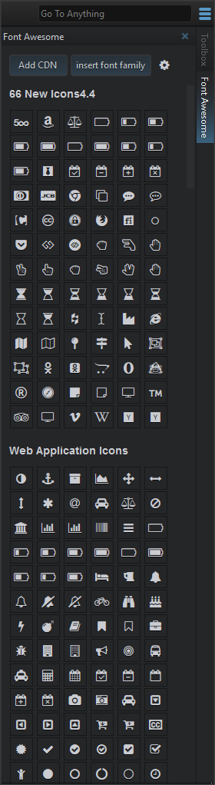

# FontAwesome
This addon adds a Font Awesome right-sidebar to Komodo edit/ide you can easily add font awesome to your projects.
Just click on the icon of your choice and the icon will be inserted.

## screenshot

<strong>1. Add cdn</strong>  
This will insert the cdn  
<pre>//maxcdn.bootstrapcdn.com/font-awesome/4.4.0/css/font-awesome.min.css</pre>
  
<strong>2. Insert font family</strong>  
<code>font-family: 'FontAwsome';</code>
  
<strong>3. Settings</strong>  
This will open the settings dialog,  
the settings are described below

### Settings
<b>Auto: insert depending on file, on css,sass,scss,less files the escaped value is inserted.</b>  
This function will insert the html fontAwesome tag except when editing style-files (css, scss, sass, less) then the escaped value will be inserted.  
So you can use the fontAwsome icons in <code>:before</code> and <code>:after</code> (examples can be found <a href="https://css-tricks.com/five-use-cases-for-icon-fonts/" target="_blank">here</a>).

<b>Full: Insert tag with class</b>  
This will insert the tag <code>&lt;i class="fa fa-icon"&gt;&lt;/i&gt;</code>

<b>Class: Insert only the class name</b>  
This will only insert the class <code>fa fa-icon</code>

<b>CSS: Insert escaped css value</b>  
This will insert the escaped css value <code>\f25b</code>