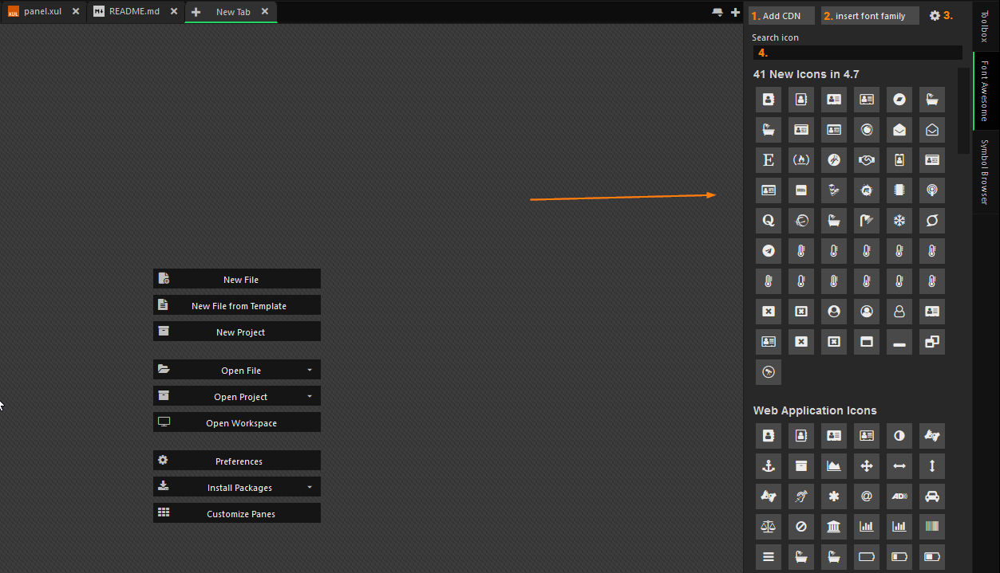

# FontAwesome Pane
This addon adds a Font Awesome right-sidebar to Komodo edit/ide you can easily add font awesome to your projects.
Just click on the icon of your choice and the icon will be inserted.

## screenshot
  
**1. Add cdn**  
This will insert the cdn
```
//maxcdn.bootstrapcdn.com/font-awesome/4.7.0/css/font-awesome.min.css
```

**2. Insert font family**  
```
font-family: 'FontAwsome';
```


**3. Settings**  
This will open the settings dialog,  
the settings are described below

**4. Search function**  
Here you can search for your font awesome icon (without the fa-)


### Settings
**Auto: insert depending on file, on css,sass,scss,less files the escaped value is inserted.**  
This function will insert the html fontAwesome tag except when editing style-files (css, scss, sass, less) then the escaped value will be inserted. So you can use the fontAwsome icons in `:before` and `:after` (examples can be found  ).

**Full: Insert tag with class**  
This will insert the tag `<i class="fa fa-icon"></i>`

**Class: Insert only the class name**  
This will only insert the class `fa fa-icon`

**CSS: Insert escaped css value**  
This will insert the escaped css value `\f25b`
